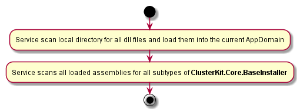

# ClusterKit.Core
Packs the actor system into the executable. Provides start-up configuration and plug-in management system.

The main idea is to get rid of writing custom service start-up code and concentrate on business logic. 

By default, you have the `ClusterKit.Core.Service` that will start the almost empty actor system, configure logging (with a use of [Serilog](https://serilog.net/)) and dependency injection (with a use of [Autofac](https://autofac.org/)).
All you need is to extend the service functions by providing the plugin. Just put your plugin dll (and all it's dependencies) in the service directory and it will be loaded automatically on service start. Also, you can provide an end-level configuration with an additional file. 

## Service start procedure


## `ClusterKit.Core.BaseInstaller`
Every ClusterKit plugin should define the subtype of this type in order to be loaded properly.

### `AkkaConfigLoadPriority`
The installer load priority. The methods from installers with higher priorities will be run earlier than from lower ones. For example, during config assembling - parameters from higher priority installers will override parameters from lower priority installers.
There are two predefined constants for priorities that are used in ClusterKit packages:
* `ClusterKit.Core.BaseInstaller.PrioritySharedLib` - used for packages providing message classes and utilities for communication with other nodes functions.
* `ClusterKit.Core.BaseInstaller.PriorityClusterRole` - used for packages with end-level functions. This priority is highe then `ClusterKit.Core.BaseInstaller.PrioritySharedLib`.

### `Config GetAkkaConfig()`
Gets default akka configuration for current module.
The usual way to provide such configuration is to make embedded resource in the package (for example `Resources/akka.hocon`) and provide it like this:
```csharp
        /// <summary>
        /// Gets default akka configuration for current module
        /// </summary>
        /// <returns>Akka configuration</returns>
        protected override Config GetAkkaConfig() => ConfigurationFactory.ParseString(ReadTextResource(typeof(Installer).GetTypeInfo().Assembly, "ClusterKit.Core.Resources.akka.hocon"));
```

Also this configuration should define all needed actors to start (see [NameSpaceActor](#namespaceactor))

### `IEnumerable<string> GetRoles()`
In the case of assembling Akka Cluster provides the information for the list of cluster node roles. Usually, it has one or several values for the `PriorityClusterRole` and empty for the `PrioritySharedLib`


### `void RegisterComponents(ContainerBuilder container, Config config)`
Here all dependency injections components should be registered. At this stage, the overall configuration is already assembled and can be used.
Don't forget to register the actors if they should be instantiated via DI (`NameSpaceActor` uses DI to create child actors).
`ActorSystem` and `Config` are preregistered by service.

The typical method override:
```csharp
        /// <inheritdoc />
        protected override void RegisterComponents(ContainerBuilder container, Config config)
        {
            container.RegisterAssemblyTypes(typeof(Installer).GetTypeInfo().Assembly).Where(t => t.GetTypeInfo().IsSubclassOf(typeof(ActorBase)));
        }
```

### `void PreCheck(Config config)`
This method is not mandatory. But you can check the service configuration and environment and throw an exception in the case of misconfiguration to prevent further service start.

## `void PostStart(IComponentContext context)`
This method is not mandatory.  This method will be run after service starts. As dependency injection is fully initialized here - all needed extra components can be resolved.

## `NameSpaceActor`


#### Plan
* NamespaceActor
* TestKit - BaseActorTest
