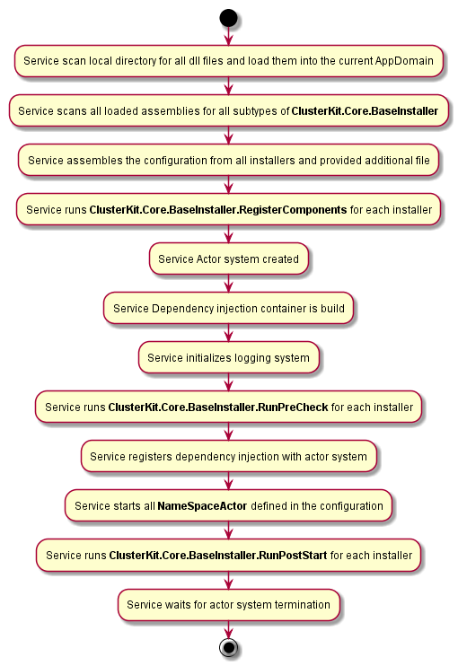

# ClusterKit.Core
Packs the actor system into the executable. Provides start-up configuration and plug-in management system.

The main idea is to get rid of writing custom service start-up code and concentrate on business logic. 

By default, you have the `ClusterKit.Core.Service` that will start the almost empty actor system, configure logging (with a use of [Serilog](https://serilog.net/)) and dependency injection (with a use of [Autofac](https://autofac.org/)).
All you need is to extend the service functions by providing the plugin. Just put your plugin dll (and all it's dependencies) in the service directory and it will be loaded automatically on service start. Also, you can provide an end-level configuration with an additional file. 

## Service start procedure


## `ClusterKit.Core.BaseInstaller`
Every ClusterKit plugin should define the subtype of this type in order to be loaded properly.

### `AkkaConfigLoadPriority`
The installer load priority. The methods from installers with higher priorities will be run earlier than from lower ones. For example, during config assembling - parameters from higher priority installers will override parameters from lower priority installers.
There are two predefined constants for priorities that are used in ClusterKit packages:
* `ClusterKit.Core.BaseInstaller.PrioritySharedLib` - used for packages providing message classes and utilities for communication with other nodes functions.
* `ClusterKit.Core.BaseInstaller.PriorityClusterRole` - used for packages with end-level functions. This priority is highe then `ClusterKit.Core.BaseInstaller.PrioritySharedLib`.

### `Config GetAkkaConfig()`
Gets default akka configuration for current module.
The usual way to provide such configuration is to make embedded resource in the package (for example `Resources/akka.hocon`) and provide it like this:
```csharp
        /// <summary>
        /// Gets default akka configuration for current module
        /// </summary>
        /// <returns>Akka configuration</returns>
        protected override Config GetAkkaConfig() => ConfigurationFactory.ParseString(ReadTextResource(typeof(Installer).GetTypeInfo().Assembly, "ClusterKit.Core.Resources.akka.hocon"));
```

Also this configuration should define all needed actors to start (see [NameSpaceActor](#namespaceactor))

### `IEnumerable<string> GetRoles()`
In the case of assembling Akka Cluster provides the information for the list of cluster node roles. Usually, it has one or several values for the `PriorityClusterRole` and empty for the `PrioritySharedLib`


### `void RegisterComponents(ContainerBuilder container, Config config)`
Here all dependency injections components should be registered. At this stage, the overall configuration is already assembled and can be used.
Don't forget to register the actors if they should be instantiated via DI (`NameSpaceActor` uses DI to create child actors).
`ActorSystem` and `Config` are preregistered by service.

The typical method override:
```csharp
        /// <inheritdoc />
        protected override void RegisterComponents(ContainerBuilder container, Config config)
        {
            container.RegisterAssemblyTypes(typeof(Installer).GetTypeInfo().Assembly).Where(t => t.GetTypeInfo().IsSubclassOf(typeof(ActorBase)));
        }
```

### `void PreCheck(Config config)`
This method is not mandatory. But you can check the service configuration and environment and throw an exception in the case of misconfiguration to prevent further service start.

## `void PostStart(IComponentContext context)`
This method is not mandatory.  This method will be run after service starts. As dependency injection is fully initialized here - all needed extra components can be resolved.

## `NameSpaceActor`
During the start procedure service scans the configuration `akka.actor.deployment` section for root pathes with `IsNameSpace` setting. The it starts the `NameSpaceActor` on the specified path.
```
{
    akka : {
    	actor : {
    		deployment {
				/Core {
					IsNameSpace = true
				}
			}
		}
	}
}

```

The `NameSpaceActor` on start scans the same `akka.actor.deployment` for direct child pathes and creates child actors according to specified configuration.
So to start the root actors - they need to be defined in the configuration in the folowing way: 

### Simple actor creation
```
{
    akka : {
    	actor : {
    		deployment {
				/Core {
					IsNameSpace = true
				}
				/Core/Ping {
					actor-type = "Simple" # this is the value by default
					type = "ClusterKit.Core.Ping.PingActor, ClusterKit.Core" # Full type name of actor to create. The actor is created via DI infrastructure, so type shoul be registered
				}
			}
		}
	}
}

```

To bring some structure to the actors tree the nested `NameSpaceActor` can be created.
```
	akka.actor.deployment {
		/Web {
			IsNameSpace = true
		}

		/Web/Nginx {
			type = "ClusterKit.Core.NameSpaceActor, ClusterKit.Core"
		}                

		/Web/Nginx/Configurator {
			type = "ClusterKit.Web.NginxConfigurator.NginxConfiguratorActor, ClusterKit.Web.NginxConfigurator"
		}
	}
```


### Cluster singleton creation
Please check Akka.NET documentation for Akka.Cluster singleton actors

```
        akka.actor.deployment {
        
                /NodeManager {
                        IsNameSpace = true
                }

                /NodeManager/Manager {
                        actor-type = Singleton # defines that Akka.Cluster singleton actor is created here
                        singleton-name = NodeManager # Akka.Cluster singleton name. Please check Akka.NET documentation
                        singleton-node-role = NodeManager # the cluster nodes role where singleton actor is rised. This roles should be defined in ClusterKit.Core.BaseInstaller.GetRoles method. Please check Akka.NET documentation for further information. 
                        type = "ClusterKit.NodeManager.NodeManagerActor, ClusterKit.NodeManager"  # Full type name of actor to create. The actor is created via DI infrastructure, so type shoul be registered     
                }
        }
```

### Cluster singleton proxy creation
Please check Akka.NET documentation for Akka.Cluster singleton proxies

```
	akka.actor.deployment {
		/NodeManager {
			IsNameSpace = true
		}

		/NodeManager/NodeManagerProxy {
			actor-type = SingletonProxy  # defines that Akka.Cluster singleton proxy is created here
			singleton-name = NodeManager # Akka.Cluster singleton name. Please check Akka.NET documentation. The same name should be defined for singleton actor.
			singleton-path = "/user/NodeManager/Manager" # the path to the original singleton actor. Please check Akka.NET documentation for further information. 
			singleton-node-role = NodeManager  # the cluster nodes role where singleton actor is rised. Pleasee check Akka.NET documentation for further information.          
		}
	}
```          

### Cluster sharding actor (Akka.Cluster.Sharding)
Please check Akka.NET documentation for Akka.Cluster.Sharding

```
	akka.actor.deployment {
		/Sharding {
			IsNameSpace = true
		}

		/Sharding/Sharded {
			actor-type = Sharding # defines that Akka.Cluster.Sharding actors are created here
			type-name = clusterkit-sharding # the unique type name for this sharding family. Please check Akka.NET documentation for further information. 
			role = clusterkit-sharding # the cluster nodes role where actors are rised. Pleasee check Akka.NET documentation for further information.  
			type = "ClusterKit.Core.Example.ShardedActor, ClusterKit.Core.Example" # Full type name of actor to create. The actor is created via DI infrastructure, so type shoul be registered
			message-extractor = "ClusterKit.Core.Example.RegionMessageExtractor, ClusterKit.Core.Example" # Full type name for sharding message extractor. Please check Akka.NET documentation for further information. 
		}
	}

```

### Cluster sharding proxy actor (Akka.Cluster.Sharding)
Please check Akka.NET documentation for Akka.Cluster.Sharding

```
	akka.actor.deployment {
		/Sharding {
			IsNameSpace = true
		}

		/Sharding/Sharded {
			actor-type = ShardingProxy # defines that Akka.Cluster.Sharding proxy actors are created here
			type-name = clusterkit-sharding # the unique type name for this sharding family. Please check Akka.NET documentation for further information. 
			role = lusterkit-sharding # the cluster nodes role where actors are rised. Pleasee check Akka.NET documentation for further information.  
			message-extractor = "ClusterKit.Core.Example.RegionMessageExtractor, ClusterKit.Core.Example" # Full type name for sharding message extractor. Please check Akka.NET documentation for further information. 
		}
	}

```

**NOTE:** Akka.Cluster.Sharding proxies and real sharding actors can be rised on the same path and defined in default configurations. Sharding proxy can be defined in client library configuration and sharding actors in role lib. So if only clien library is installed - the sharding proxy will be rised. If both role and client libraries are installed then rol library overrides the clients config and real actors are rised.


## Testing
In order to help create tests `ClusterKit.Core.TestKit` brings some extensions to the regular `Akka.TestKit` package.

### `ClusterKit.Core.TestKit.BaseActorTest<TConfigurator>`
This is the extended class that helps to configure the ActorSystem and overall test environment.

```csharp
    /// <summary>
    /// Testing <seealso cref="PingActor"/>
    /// </summary>
    public class PingTest : BaseActorTest<PingTest.Configurator>
    {
        /// <summary>
        /// Initializes a new instance of the <see cref="PingTest"/> class.
        /// The test ping.
        /// </summary>
        /// <param name="output">
        /// The output.
        /// </param>
        public PingTest(ITestOutputHelper output)
            : base(output)
        {
        }

        /// <summary>
        /// Testing ping actor
        /// </summary>
        [Fact]
        public void TestNetworkPing()
        {
            this.Sys.StartNameSpaceActorsFromConfiguration();
            var now = DateTime.UtcNow;
            var address = Cluster.Get(this.Sys).SelfAddress;

            this.Sys.ActorSelection($"{address}/user/Core/Ping").Ask<PongMessage>(new PingMessage(), TimeSpan.FromMilliseconds(200));
            var elapsed = (DateTime.UtcNow - now).TotalMilliseconds;
            this.Sys.Log.Info("Ping in {0}ms", elapsed);
        }

        /// <summary>
        /// Testing ping actor
        /// </summary>
        [Fact]
        public void TestPing()
        {
            this.Sys.StartNameSpaceActorsFromConfiguration();
            var now = DateTime.UtcNow;
            this.Sys.ActorSelection("/user /Core/Ping").Ask<PongMessage>(new PingMessage(), TimeSpan.FromMilliseconds(200));
            var elapsed = (DateTime.UtcNow - now).TotalMilliseconds;
            this.Sys.Log.Info("Ping in {0}ms", elapsed);
        }

        /// <summary>
        /// Configures current test system
        /// </summary>
        public class Configurator : TestConfigurator
        {
	        /// <summary>
	        /// Gets a value indicating whether <see cref="BaseInstaller.RunPostStart"/> should be called
	        /// </summary>
	        public override bool RunPostStart => false;        	
    
            /// <summary>
	        /// Gets the akka system config
	        /// </summary>
	        /// <param name="containerBuilder">
	        /// The container builder
	        /// </param>
	        /// <returns>
	        /// The config
	        /// </returns>
            public override Config GetAkkaConfig(ContainerBuilder containerBuilder)
            {
                return ConfigurationFactory.ParseString(@"{}").WithFallback(base.GetAkkaConfig(containerBuilder));
            }


            /// <summary>
            /// Gets list of all used plugin installers
            /// </summary>
            /// <returns>The list of installers</returns>
            public override List<BaseInstaller> GetPluginInstallers()
            {
               return new List<BaseInstaller> { new Core.Installer(), new Installer() };
            }
        }
    }

```
