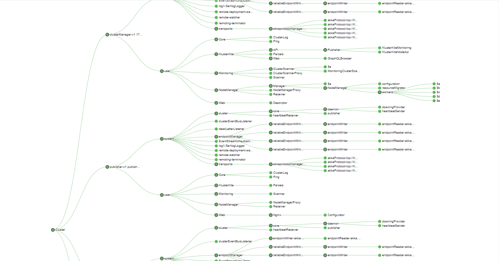

# KlusterKite.Monitoring

Collecting diagnostics and monitoring information from cluster nodes.

This module contains just two plugins.

## `KlusterKite.Monitoring.Client`
This plugin should be installed in every node to provide the diagnostic information.

## `KlusterKite.Monitoring`
This plugin gathers and presents the diagnostics information.
At this moment the only one function is available - gather the whole cluster tree structure with some additional attributes. It is useful to search for system bottlenecks. We can suppose that actors that have a growing non-empty message queue can be such bottlenecks in overall system performance.

The UI provides the tree visualization and will mark actors with a queue with more than 1 message as red and their parent actor as orange. Also, you can get information of actor's dispatcher type, the maximum queue size in its whole subtree and the sum of sizes of all subtree queues.

