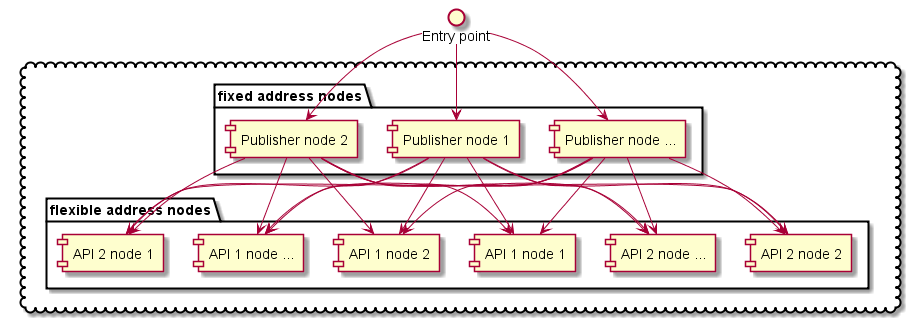

# KlusterKite.Web
A bundle of generic actors and other abstractions to publish Web API (both REST and GraphQL). Also, provides authentication and authorization for external applications.

## Publishing API for client applications and The Web

We have an interesting problem. From the one hand, we want flexible, fault-tolerant application cluster where nodes are going up and down, upgrading, changing their roles and e.t.c. From the other, we have client applications that need to be configured for API access points with well-known addresses.

How this problem is solved in **KlusterKite**:


For example, we have some API nodes that publishes their part of an API, some content or else. They can go up and down at any moment, get new API, remove old and e.t.c.

Then we need several nodes, that have fixed addresses and doesn't need a frequent update. They are aware of cluster state, the API nodes and the API itself. They will distribute requests to the API node. We call them `Publisher nodes`

And an entry point. This can be a CDN like CloudFlare, some hosting provider solution or else. All we need is reliability, ability to work as NLB and fault tolerance. It should proxy all requests to the list of fixed `Publisher nodes` nodes.

To make your API discoverable by `Publisher nodes` the `API node` should have `KlusterKite.Web.Descriptor` plugin installed and well configured.
Example configuration:
```
{
    KlusterKite {
        Web {
            Services {
                KlusterKite/Monitoring  { // ServiceName is just unique service identification, used in order to handle stacked config properly. It is used just locally on node
                Port = 8080 // default port, current node listening port for server access
                PublicHostName = default //public host name of this service. It isn't supposed (but is not prohibited) that this should be real public service hostname. It's just used to distinguish services with identical URL paths to be correctly published on frontend web servers. Real expected hostname should be configured in NginxConfigurator or similar publisher
                Route = "/api/1.x/klusterkite/monitoring" //route (aka directory) path to service
                }                    
        }
    }
}
```

As for now `Publisher node` can be created with the use of `KlusterKite.Web.NginxConfigurator` plugin. It assumes that there is an installed dedicated `Nginx` service on this node. The `Nginx` will make actual proxying and the node will make a dynamic Nginx reconfiguration from the current cluster state.
 
An example `KlusterKite.Web.NginxConfigurator` configuration:
```
{
  KlusterKite {
    Web {
      Nginx {
        PathToConfig = "/etc/nginx/sites-enabled/klusterkite.config"
        ReloadCommand {
          Command = /etc/init.d/nginx
          Arguments = reload
        } 
        Configuration {
          default { // here can be defined static paths
            "location /klusterkite" { 
              proxy_pass = "http://monitoringUI/klusterkite"
            }
          }
        }
      }
    }
  }
}     
``` 

## AspNet.Core Controllers

In order to self-host the AspNet.Core Kestrel there is a `KlusterKite.Web` plugin.
The example configuration:
```
 {
  KlusterKite.Core.RestTimeout = 10s
  KlusterKite {
    Web {
      Debug.Trace = false #outputs to log every start and finish request events
      BindAddress = "http://*:8080"
      Services {
        //ServiceName { // ServiceName is just unique service identification, used in order to handle stacked config properly. It is used just locally on node
        //  Port = 8080 // current node listening port for server access
        //  PublicHostName = default //public host name of this service. It doesn't suppose (but is not prohibited) that this should be real public service hostname. It's just used to distinguish services with identical URL paths to be correctly published on frontend web servers. Real expected hostname should be configured in NginxConfigurator or similar publisher
        //  Route = /directory/sub //route (aka directory) path to service
        //  LocalHostName = $host //local hostname that proxy should path. This should be used to support virtual hosting inside single node
        //}
      }

      // add needed configurators. If you want to remove configurator from fallback config - just put empty string with the same name
      Configurators {
        WebTracer = "KlusterKite.Web.WebTracer, KlusterKite.Web"
      }
    }
  }
}
```

This plugin automagically registers in the DI all subclasses of `ApiController`.

As AspNet hosting is partialy configured before DI configuration, the additional configuration of hosting could be done via [`IWebHostingConfigurator`](../Docs/Doxygen/html/interface_kluster_kite_1_1_web_1_1_i_web_hosting_configurator.html) implementations that shout be described in the `KlusterKite.Web.Configurators` configuration section (as shown above).

## Authentication

`KlusterKite.Web.Authentication` plugin implements `Bearer` authentication from oAuth2 protocol. Check thie [`ClusterKit.Security`](../ClusterKit.Security/Readme.md) documentation for `IClientProvider` and `ITokenManager`.

## Authorization

* [`AuthorizedController`](../Docs/Doxygen/html/class_kluster_kite_1_1_web_1_1_authorization_1_1_authorized_controller.html) provides the extension methods to access the current authenticated user session and additional request data.
* [`KlusterKite.Web.Authorization.Attributes`](../Docs/Doxygen/html/namespace_kluster_kite_1_1_web_1_1_authorization_1_1_attributes.html) provides attributes that will limit access for contollers or controller methods only for certain user and/or client privileges.

## GraphQl

`KlusterKite.Web.GraphQL.Publisher` scans the whole cluster for the published API (see [`KlusterKite.API`](../KlusterKite.API.Readme.md)) and generates and publishes the global scheme with access to every part of it.

As cluster nodes can get up and down, the defined API can be changed so will do the GraphQL scheme. As root containing types can be defined in different APIs (such as `viewer` or `me` where different API can provide different fields) the type of field is not stable. But it always implements the certain interfaces from the certain (and only one API). So it is strongly recommended to use interfaces in fragments definitions - not the end-types.